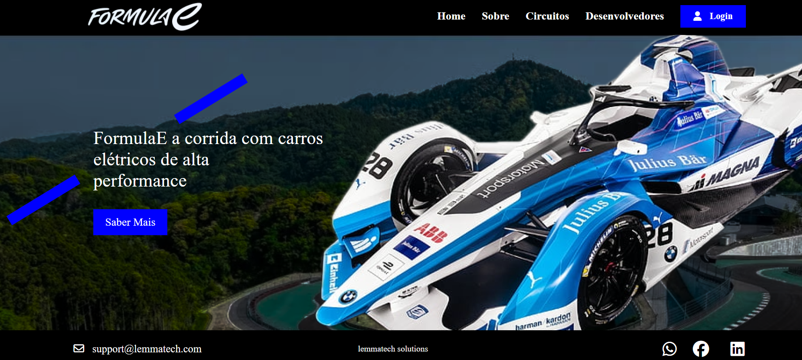

<h1>Projeto de corrida de carros - Formula E</h1>

<h3>Link do projeto</h3>

<h1>Descrição do Projeto 📝</h1>

 Esse é um site sobre circuitos de corrida com o foco em divulgar a Formula E </h1>

<h1>Componentes Utilizados 🛠️</h1>
<ul>
<li><b>React</b> para criar a interface</li>
<li><b>Node.js</b> para instalar as dependências e executar o código</li>
<li><b>Javascript</b> para criar validação de login, cadastro e alguns efeitos na página</li>
</ul>

# Participantes:

<table>
  
<tr>
<th>Desenvolvedor</th>
<th>Icone</th>
<th>RM</th>
</tr>

<tr>
<td>Carolina </td>
<td></td>
<td>RM86833</td>
</tr>
  
<tr>
<td>Alexandre </td>
<td></td>
<td>RM558270</td>
 </tr>

 
<tr>
<td>Milena</td>
<td></td>
<td>RM554682</td>
 </tr>

 
 <tr>
<td>Evellyn</td>
<td></td>
<td>RM557929</td>
 </tr>
</table>

